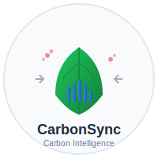
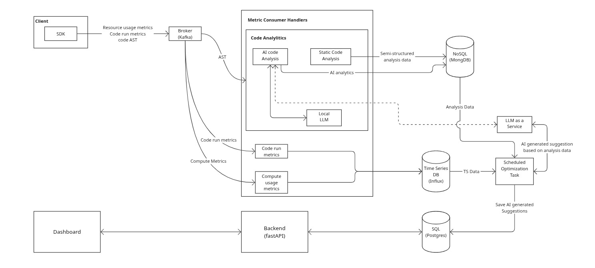

# WIP

<div align="center">
  
</div>

# CarbonSync 🌱

> How much Carbon your software is producing?

> Real-time carbon footprint monitoring and optimization for software systems.

[](https://choosealicense.com/licenses/mit/)
[](https://www.python.org/downloads/release/python-380/)
[](https://www.docker.com/)

**CarbonSync** helps you track, analyze, and optimize the carbon footprint of your applications in real-time. With the EU’s increasing focus on sustainability reporting, CarbonSync provides the tools you need to monitor and reduce your software’s environmental impact.

## ✨ Features

- 🔍 **Real-time Monitoring**: Track CPU, memory, network, and storage carbon impact
- 📊 **Rich Analytics**: Dashboards, trends, and service comparisons
- 🤖 **AI-Powered Insights**: Get optimization suggestions powered by machine learning
- 🔌 **Easy Integration**: Simple SDK with decorator-based tracking
- ⚡ **High Performance**: Built on FastAPI, ClickHouse, and Kafka for scale
- 🌍 **EU-Ready**: Carbon intensity data for European cloud regions

## 🚀 Quick Start

### 1. Install the Python SDK

```bash
pip install carbonsync
```

### 2. Start Monitoring

```python
from carbonsync import CarbonMonitor
import asyncio

# Initialize monitor
monitor = CarbonMonitor(
    api_key="your-api-key",
    service_name="my-web-service"
)

# Start background monitoring
asyncio.create_task(monitor.start_monitoring(interval=30))
```

### 3. Track Functions

```python
from carbonsync import carbon_track

@carbon_track(service_name="user-service")
async def process_user_data(user_id: int):
    # Your application logic here
    user = await fetch_user(user_id)
    return await process_data(user)
```

### 4. View Your Dashboard

```bash
docker-compose up -d
# Navigate to http://localhost:3000
```

## 📦 Installation

### Option 1: Docker Compose (Recommended)

```bash
git clone https://github.com/ishmam-hossain/carbonsync.git
cd carbonsync
docker-compose up -d
```

### Option 2: Local Development

```bash
# Clone repository
git clone https://github.com/ishmam-hossain/carbonsync.git
cd carbonsync

# Install dependencies
pip install -r requirements.txt

# Start services
python -m carbonsync.api.gateway
```

## 🏗️ Architecture

```
┌─────────────────┐    ┌──────────────────┐    ┌─────────────────┐
│   SDK Agents    │───▶│ Message Broker   │───▶│  Time-Series DB │
│ (Python/Node.js)│    │ (Kafka)          │    │                 │
└─────────────────┘    └──────────────────┘    └─────────────────┘
                                │                       │
                                ▼                       ▼
┌─────────────────┐    ┌──────────────────┐    ┌─────────────────┐
│   Dashboard     │◀───│  Analytics API   │◀───│ AI/ML Pipeline  │
│   (React)       │    │  (FastAPI)       │    │                 │
└─────────────────┘    └──────────────────┘    └─────────────────┘
```

<div align="center">
  
</div>

## 📊 Example Output

```bash
$ carbonsync status --service web-api

🌱 CarbonSync Status - web-api
┌─────────────────┬──────────────┐
│ Metric          │ Value        │
├─────────────────┼──────────────┤
│ CO2/hour        │ 45.2g        │
│ Cost/month      │ $23.40       │
│ Efficiency      │ 7.2/10       │
│ Trend (24h)     │ ↓ -12%       │
└─────────────────┴──────────────┘

💡 Top Suggestions:
• Reduce database query timeout (-23% CO2)
• Enable response caching (-18% CO2)
• Migrate to eu-west-1 region (-15% CO2)
```

## 🌍 Use Cases

- **DevOps Teams**: Monitor CI/CD pipeline carbon costs
- **Engineering Teams**: Track feature-level environmental impact
- **Compliance Teams**: Generate EU taxonomy-compliant reports
- **Engineering Leaders**: Optimize infrastructure costs and sustainability

## 🛠️ Development

### Prerequisites

- Python 3.8+
- Docker & Docker Compose
- Node.js 16+ (for dashboard)

### Setup Development Environment

```bash
# Clone repository
git clone https://github.com/ishmam-hossain/carbonsync.git
cd carbonsync

# Create virtual environment
python -m venv venv
source venv/bin/activate  # On Windows: venv\Scripts\activate

# Install dependencies
pip install -r requirements-dev.txt
pip install -e .

# Start development services
docker-compose -f docker-compose.dev.yml up -d

# Run tests
pytest tests/ -v
```

## 📚 Documentation

- [API Documentation](docs/api.md)
- [SDK Reference](docs/sdk.md)
- [Deployment Guide](docs/deployment.md)
- [Contributing](CONTRIBUTING.md)

## 🤝 Contributing

We welcome contributions! Please see our [Contributing Guide](CONTRIBUTING.md) for details.

1. Fork the repository
1. Create your feature branch (`git checkout -b feature/amazing-feature`)
1. Commit your changes (`git commit -m 'Add amazing feature'`)
1. Push to the branch (`git push origin feature/amazing-feature`)
1. Open a Pull Request

## 📝 License

This project is licensed under the MIT License - see the <LICENSE> file for details.

## 🙏 Acknowledgments

- Inspired by the urgent need for software sustainability
- Built for the European Union’s Green Deal initiatives
- Powered by open-source technologies

## 📞 Support

- 🐛 [Report Issues](https://github.com/ishmam-hossain/carbonsync/issues)
- 💬 [Discussions](https://github.com/ishmam-hossain/carbonsync/discussions)
- 📧 Contact: ishmam.dev@gmail.com

-----

**Made with 🌱 for a sustainable future**
